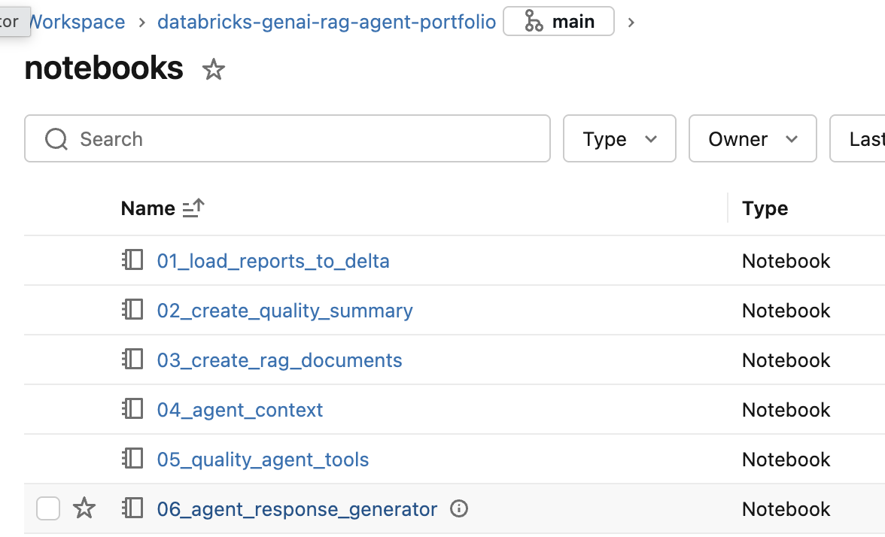
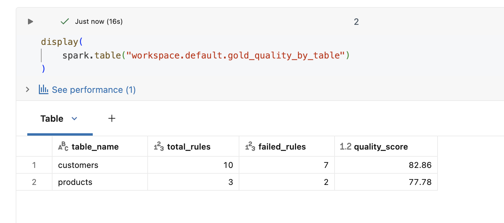
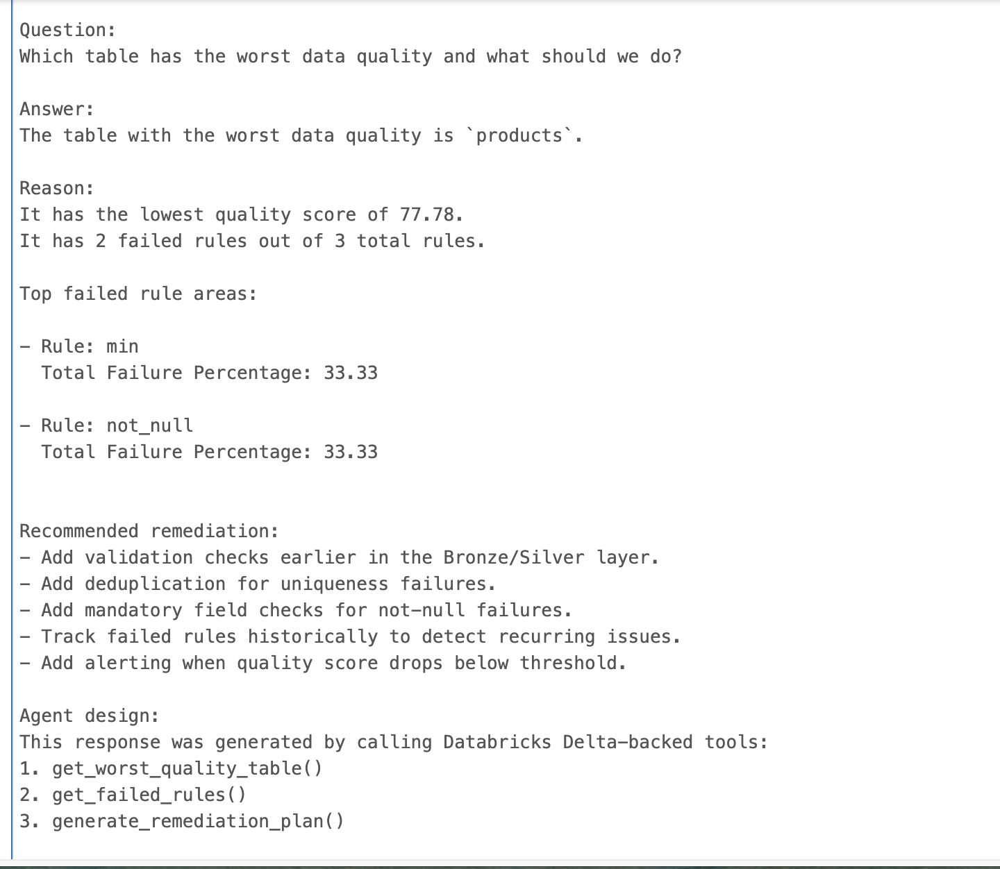

# AI Data Quality Assistant on Databricks

## Overview

AI Data Quality Assistant is a GenAI-inspired Data Engineering project built on Databricks.

The solution automates data quality analysis by transforming validation reports into Delta Lake tables, generating quality metrics, creating retrieval-ready documents, and exposing agent-style capabilities for root cause analysis and remediation recommendations.

This project demonstrates practical usage of:

- Databricks
- Delta Lake
- PySpark
- Data Quality Frameworks
- Agent Design Patterns
- Retrieval-Augmented Generation (RAG) Foundations
- GitHub Integration

---
## Screenshots

### Databricks Workspace



### Gold Quality Metrics



### Agent Response



## Business Problem

Data Engineering teams spend significant time investigating data quality failures.

Typical challenges include:

- Reviewing validation reports manually
- Identifying impacted datasets
- Understanding failed rules
- Tracking historical quality degradation
- Defining remediation actions

The goal of this project is to build an intelligent assistant capable of answering questions such as:

- Which table has the worst quality?
- What rules are failing most frequently?
- What is the business impact?
- What remediation actions should be taken?

---

## Architecture

```text
Validation Reports (CSV)
        |
        v
Bronze Delta Tables
        |
        v
Gold Quality Metrics
        |
        v
RAG Documents
        |
        v
Agent Tools
        |
        v
AI Data Quality Assistant
```

---

## Data Sources

### validation_report.csv

Contains:

- Table Name
- Column Name
- Validation Rule
- Failure Percentage
- Failed Records

### summary_report.csv

Contains:

- Total Rules
- Passed Rules
- Failed Rules
- Quality Score

### history.csv

Contains historical quality scores across multiple runs.

---

## Databricks Implementation

| Notebook | Purpose |
|-----------|----------|
| 01_load_reports_to_delta | Load validation reports into Delta tables |
| 02_create_quality_summary | Create Gold quality metrics |
| 03_create_rag_documents | Generate RAG-ready documents |
| 04_agent_context | Create agent context |
| 05_quality_agent_tools | Build agent tools |
| 06_agent_response_generator | Generate business-friendly responses |

---

## Example Question

> Which table has the worst data quality and what should we do?

Example response:

- Identify the lowest quality score
- Explain failed rules
- Recommend remediation actions
- Suggest monitoring improvements

---

## Future Enhancements

### GenAI

- Databricks Foundation Models
- Agent Frameworks
- Tool Calling
- Prompt Engineering

### RAG

- Vector Search
- Embeddings
- Semantic Retrieval

### MLOps

- Model Serving
- Automated Evaluation
- Monitoring

### Integrations

- Slack Notifications
- Teams Integration
- Jira Ticket Creation

---

## Tech Stack

- Databricks
- PySpark
- Delta Lake
- GitHub
- Python

---

## Repository Structure

```text
data/
notebooks/
docs/
README.md
```